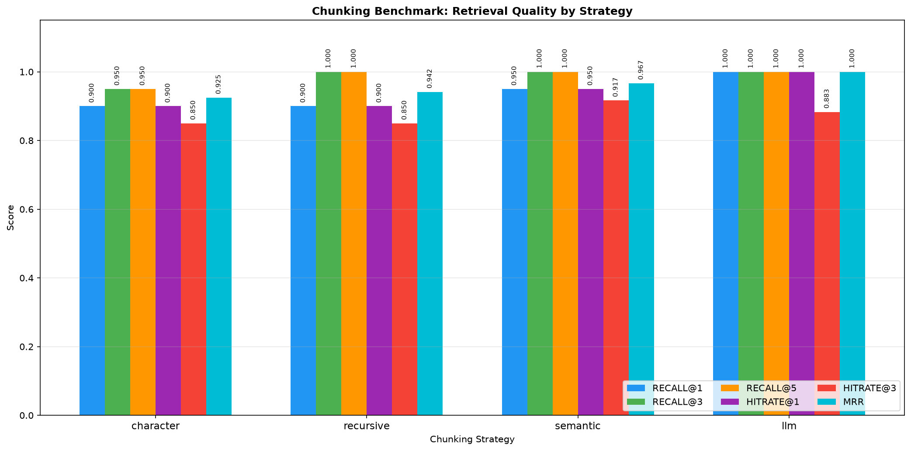
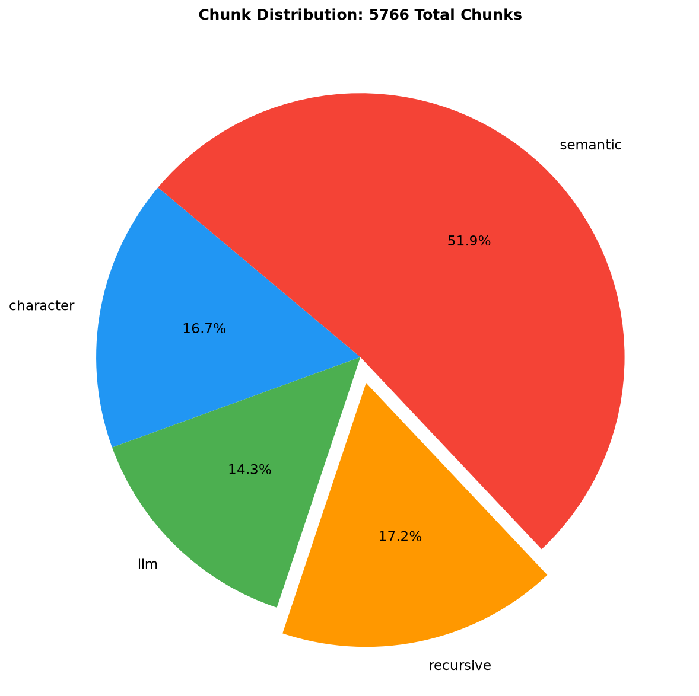
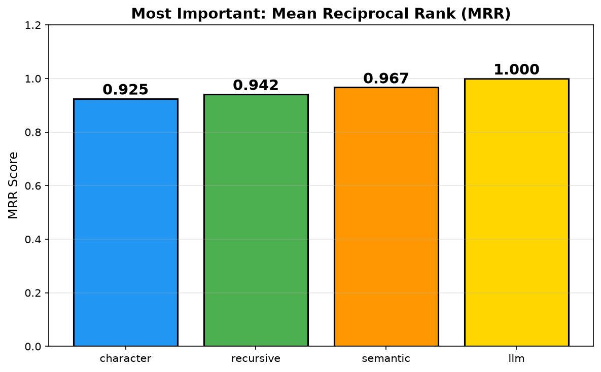

# LLM Engineer Lab 2 — Chunking Benchmark


> **Scientific Question:** Which chunking strategy produces the highest retrieval quality for a RAG system on Java documentation?

---

## 1. Problem Statement

In Retrieval-Augmented Generation (RAG) systems, the way documents are split into chunks can directly affect retrieval quality.

Instead of selecting a chunking strategy based on convention or popularity, this lab benchmarks four different approaches using the **same dataset, embedding model, queries, and retrieval evaluation process**.

The goal is to make a data-driven engineering decision:

> Does more sophisticated chunking actually produce better retrieval results?

---

## 2. Dataset

* **Source:** Official Java SE documentation
* **Content:** 17 Java classes, including `String`, `ArrayList`, `HashMap`, `HashSet`, `Exception`, `Thread`, and others
* **Size:** 18,917 lines after cleaning
* **Format:** HTML → cleaned Markdown
* **Dataset limitation:** This is a relatively small corpus. Results may differ on larger and more diverse documentation collections.

---

## 3. Ground Truth

Relevance is defined at the **document/class level**.

Each evaluation query contains one or more `relevant_classes`, representing the Java documentation sources that should be considered relevant to that query.

Example:

```json
{
  "query": "How does HashSet relate to HashMap internally?",
  "relevant_classes": ["HashSet", "HashMap"],
  "type": "multi_source"
}
```

During evaluation, the benchmark compares the `source` metadata of retrieved chunks against these relevant classes.

This is a **coarse-grained ground truth**: relevance is annotated at the source level rather than individually labeling every chunk as relevant or irrelevant.

---

## 4. Chunking Strategies

Four chunking strategies were evaluated.

| # | Strategy      | How It Works                                                            | Main Characteristic |
| - | ------------- | ----------------------------------------------------------------------- | ------------------- |
| 1 | **Character** | Fixed 1000-character windows with 200-character overlap                 | Simple baseline     |
| 2 | **Recursive** | Hierarchical separators such as paragraphs, lines, sentences, and words | Structure-aware     |
| 3 | **Semantic**  | Groups sentences according to embedding similarity                      | Topic-aware         |
| 4 | **LLM**       | Local Llama predicts semantic boundaries using breakpoint indices       | LLM-guided          |

### LLM Chunking

The LLM chunker uses a **boundary-index approach**.

The local Llama model does not rewrite or summarize the documentation. It only predicts where conceptual boundaries should occur.

The original text is then reconstructed using those boundaries.

This makes the chunking process **lossless** with respect to the original document content.

---

## 5. Evaluation Methodology

### Pipeline

```text
Java Documentation
        │
        ▼
Clean & Normalize
        │
        ├──────────────┬──────────────┬──────────────┐
        ▼              ▼              ▼              ▼
   Character       Recursive       Semantic         LLM
        │              │              │              │
        └──────────────┴──────────────┴──────────────┘
                       │
                       ▼
              all-MiniLM-L6-v2
                   Embeddings
                       │
                       ▼
                  FAISS Search
                       │
                       ▼
                   50 Queries
                       │
                       ▼
              Retrieval Metrics
```

### Query Set

The benchmark contains **50 queries** distributed across five categories:

* **Direct** — explicitly names the target class
* **Conceptual** — asks about the concept or behavior
* **Multi-concept** — combines multiple related concepts
* **Indirect** — avoids explicitly naming the target class
* **Multi-source** — requires multiple documentation sources

Indirect queries are particularly useful because they reduce the advantage of simple exact-name matching.

### Metrics

| Metric               | Type     | Definition                                                  |
| -------------------- | -------- | ----------------------------------------------------------- |
| **Recall@k**         | Standard | Fraction of relevant sources found within the top-k results |
| **Precision@k**      | Standard | Fraction of top-k retrieved results that are relevant       |
| **MRR**              | Standard | Mean Reciprocal Rank of the first relevant result           |
| **Efficiency Score** | Custom   | `MRR / Number of Chunks × 1000`                             |

> **Note:** Efficiency Score is a custom decision-support metric created for this lab. It is not a standard information-retrieval metric.

---

## 6. Results

| Strategy      |  Chunks |       MRR | Recall@5 | Precision@5 | Efficiency |
| ------------- | ------: | --------: | -------: | ----------: | ---------: |
| **Character** |     961 |     0.900 |    0.980 |   **0.780** |      0.937 |
| Recursive     |     989 |     0.885 |    0.980 |       0.748 |      0.895 |
| **Semantic**  |   2,990 | **0.902** |    0.930 |       0.760 |      0.302 |
| **LLM**       | **826** |     0.897 |    0.980 |       0.720 |  **1.086** |

### Performance by Query Type

| Query Type    |  Best MRR | Best Strategy  |
| ------------- | --------: | -------------- |
| Direct        |     1.000 | All strategies |
| Conceptual    |     0.950 | LLM            |
| Multi-concept |     0.950 | Character      |
| **Indirect**  | **0.800** | **Semantic**   |
| Multi-source  |     0.950 | Character      |

### Engineering Interpretation

The results show that **no complex chunking strategy produced a decisive retrieval-quality advantage on this dataset**.

Character chunking performed surprisingly well despite being the simplest approach.

Semantic chunking achieved the highest overall MRR at **0.902**, but the difference from Character chunking (**0.900**) is extremely small while Semantic generated approximately three times as many chunks.

The LLM chunker generated the **fewest chunks (826)** and achieved an MRR of **0.897**, but did not clearly outperform the simpler baselines.

Semantic chunking performed particularly well on indirect queries, suggesting that semantic grouping can help when the target class is not explicitly mentioned.

### Engineering Verdict

> **On this dataset, increasing chunking complexity did not produce a proportional improvement in retrieval quality.**

The main engineering lesson is not that Character Chunking is universally the best strategy.

Instead:

> **A more sophisticated chunking strategy should justify its additional computational and operational cost with measurable retrieval improvements.**

For this particular corpus and evaluation setup, the simple Character baseline provides a strong quality-to-complexity trade-off.

---

## 7. Charts

### Metrics Comparison

<p align="center">
  
</p>

### Chunk Distribution

<p align="center">
  
</p>

### MRR Comparison

<p align="center">
  
</p>

---

## 8. Production RAG API

Lab 2 also exposes the retrieval system through a **FastAPI HTTP API**.

The API allows a client to select a chunking strategy and retrieve relevant chunks without directly interacting with the Python environment.

Available strategies:

```text
character
recursive
semantic
llm
```

Example request:

```http
GET /search?q=How+to+create+a+String&strategy=character&k=3
```

Available endpoints:

```text
GET /
GET /health
GET /search
GET /search/stream
```

Example response:

```json
{
  "query": "How to create a String",
  "strategy": "character",
  "k": 3,
  "results": [
    {
      "score": 0.4457,
      "source": "String",
      "chunk_id": "String_character_0005"
    }
  ]
}
```

The API is also packaged with a Dockerfile for containerized deployment.

---

## 9. Quick Start

### Install dependencies

```bash
pip install -r requirements.txt
```

### Generate chunks

```bash
python src/chunkers/character_chunker.py
python src/chunkers/recursive_chunker.py
python src/chunkers/semantic_chunker.py
python src/chunkers/llm_chunker.py
```

### Run the benchmark

```bash
python src/evaluation/benchmark.py
```

The benchmark generates:

```text
data/chunks/benchmark_results.json
data/chunks/analysis.json
```

### Start the API

```bash
python api/main.py
```

Then open:

```text
http://localhost:8000
```

FastAPI also provides interactive API documentation at:

```text
http://localhost:8000/docs
```

---

## 10. Project Structure

```text
lab-2-chunking-benchmark/
│
├── api/
│   └── main.py                  # FastAPI RAG server
│
├── data/
│   ├── chunks/                  # Chunked datasets + benchmark results
│   ├── processed/java_docs/     # Cleaned Markdown documents
│   └── raw/java_docs/html/      # Original HTML documents
│
├── src/
│   ├── chunkers/                # Four chunking strategies
│   ├── data/
│   │   └── cleaner.py           # Document cleaning pipeline
│   └── evaluation/
│       ├── benchmark.py         # Retrieval evaluation suite
│       └── queries.json         # 50 evaluation queries
│
├── reports/                     # Generated benchmark charts
├── Dockerfile
├── requirements.txt
└── README.md
```

---

## 11. Limitations & Future Work

### Limitations

* **Dataset size:** 17 classes is small compared with a production documentation corpus.
* **Query set:** 50 queries are suitable for a portfolio benchmark but are insufficient for strong production-level statistical confidence.
* **Ground truth granularity:** Relevance is defined at the document/source level rather than the individual chunk level.
* **Embedding model:** Only `all-MiniLM-L6-v2` was used in this benchmark.
* **LLM chunking cost:** LLM generation latency and GPU cost were not included in the current Efficiency Score.
* **Efficiency metric:** The custom Efficiency Score is intended for decision support and should not be interpreted as a standard IR metric.
* **Docker reproducibility:** A Dockerfile is included, but full Docker reproducibility has not been completely validated in the local environment.

### Future Experiments

Potential extensions include:

* Expanding the dataset to hundreds of Java classes
* Increasing the evaluation set to 200+ queries
* Adding chunk-level human relevance annotations
* Benchmarking multiple embedding models
* Testing different chunk sizes and overlap values
* Adding a reranking stage
* Evaluating end-to-end RAG answer quality
* Measuring actual indexing and query latency
* Containerized deployment of the API

---

## 12. Key Takeaway

This lab demonstrates an important engineering principle:

> **Complexity should be justified by measurable improvement.**

Instead of assuming that semantic or LLM-based chunking must outperform a simple baseline, the benchmark evaluates the alternatives under the same retrieval setup and makes the trade-offs visible.

The result is not simply a "winning chunker".

It is a reproducible experiment showing **how to make an engineering decision from retrieval evidence.**

---

## 13. Author

**Farid Hassani — LLM Engineer in Training**

> *"I don't choose my chunking strategy based on hype. I benchmark it."*

---

**Lab 2 of 7 — LLM Engineer Portfolio Roadmap**
